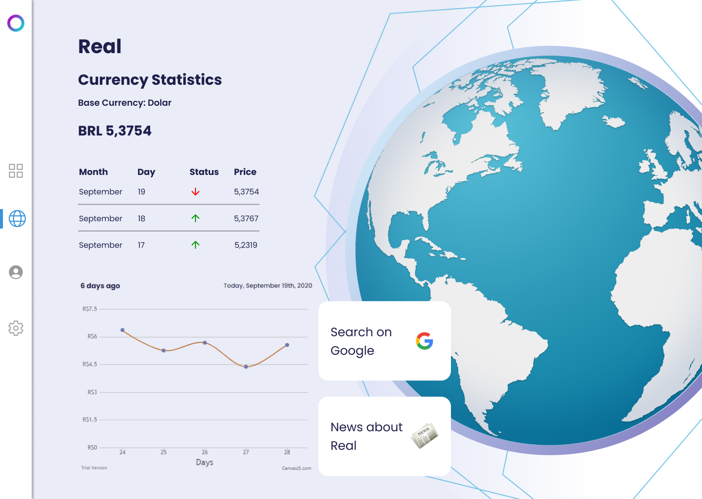

<h1 align="center">
  
</h1>

 

<h6 align="center">
  Uma plataforma para visualizar preço de moedas e estatisticas, consumindo uma currency api.
<h6/>

 

# Techs
 * [Node.js](https://nodejs.org/en/)
 * [Insomnia](https://insomnia.rest/download/)
 * [Exchangeratesapi](https://exchangeratesapi.io/)
 * [ReactJS](https://reactjs.org/)
 * [Canvas](https://canvasjs.com/react-charts/)
 * Typescript

# Design
<h1 align="center">
  
</h1>

**Design web baseado:** [Project AM](https://dribbble.com/am523_)  **Projeto:** [Dribbble](https://dribbble.com/shots/14231998-Twitter-Mentions-Dashboard?utm_source=Clipboard_Shot&utm_campaign=am523_&utm_content=Twitter%20Mentions%20Dashboard&utm_medium=Social_Share)
